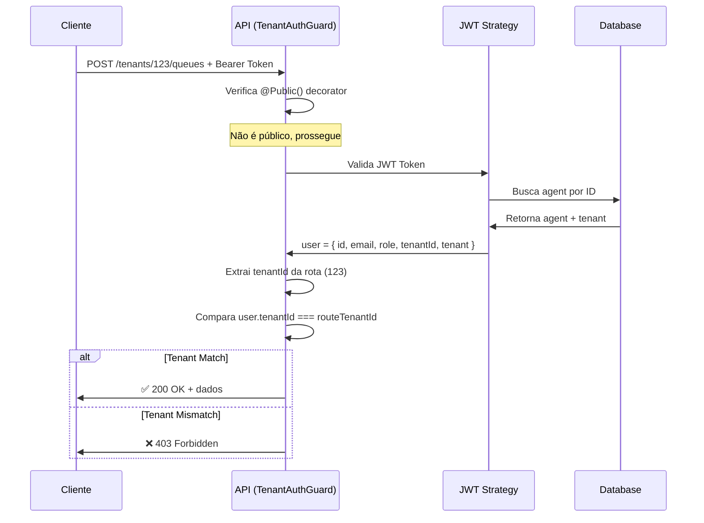

# 🔐 Implementação de Segurança JWT com Validação de Tenant

## 📋 **Resumo da Implementação**

Foi implementada uma solução completa de autenticação JWT com validação de tenant usando **Passport.js** e estratégias customizadas, sem adicionar novas bibliotecas externas.

---

## 🛠️ **Componentes Implementados**

### **1. 🔒 TenantAuthGuard**
**Arquivo**: `src/auth/guards/tenant-auth.guard.ts`

```typescript
@Injectable()
export class TenantAuthGuard extends JwtAuthGuard {
  constructor(private tenantReflector: Reflector) {
    super(tenantReflector);
  }

  async canActivate(context: ExecutionContext): Promise<boolean> {
    // 1. Verifica se rota é pública (@Public decorator)
    const isPublic = this.tenantReflector.getAllAndOverride<boolean>(IS_PUBLIC_KEY, [
      context.getHandler(),
      context.getClass(),
    ]);

    if (isPublic) {
      return true;
    }

    // 2. Valida JWT (herda do JwtAuthGuard)
    const isAuthenticated = await super.canActivate(context);
    
    if (!isAuthenticated) {
      return false;
    }

    // 3. Valida se usuário pertence ao tenant da rota
    const request = context.switchToHttp().getRequest();
    const user = request.user;
    const tenantIdFromRoute = request.params.tenantId;

    if (!tenantIdFromRoute) {
      return true; // Rotas sem tenantId
    }

    // 4. Bloqueia acesso a outro tenant
    if (user.tenantId !== tenantIdFromRoute) {
      throw new ForbiddenException(
        'Acesso negado: você não tem permissão para acessar dados deste tenant'
      );
    }

    return true;
  }
}
```

**🎯 Funcionalidades:**
- ✅ Herda validação JWT do `JwtAuthGuard`
- ✅ Adiciona validação de tenant específica
- ✅ Suporte a rotas públicas via `@Public()` decorator
- ✅ Mensagens de erro claras
- ✅ Bloqueia acesso cross-tenant

---

### **2. 🏷️ Decorators Utilitários**

#### **@Public() Decorator**
**Arquivo**: `src/auth/decorators/public.decorator.ts`

```typescript
import { SetMetadata } from '@nestjs/common';

export const IS_PUBLIC_KEY = 'isPublic';
export const Public = () => SetMetadata(IS_PUBLIC_KEY, true);
```

#### **@CurrentTenant() e @CurrentUser() Decorators**
**Arquivo**: `src/auth/decorators/current-tenant.decorator.ts`

```typescript
export const CurrentTenant = createParamDecorator(
  (data: string | undefined, ctx: ExecutionContext) => {
    const request = ctx.switchToHttp().getRequest();
    const user = request.user;
    
    if (data) {
      return user.tenant?.[data] || user[data]; // Campo específico
    }

    return {
      id: user.tenantId,
      ...user.tenant,
    };
  },
);

export const CurrentUser = createParamDecorator(
  (data: string | undefined, ctx: ExecutionContext) => {
    const request = ctx.switchToHttp().getRequest();
    const user = request.user;
    
    if (data) {
      return user[data]; // Campo específico: @CurrentUser('role')
    }

    return user; // Usuário completo
  },
);
```

**🎯 Uso Prático:**
```typescript
@Post()
@UseGuards(TenantAuthGuard)
async create(
  @Param('tenantId') tenantId: string,
  @Body() createDto: CreateDto,
  @CurrentUser() user: any,           // Usuário completo
  @CurrentUser('role') role: string,  // Apenas role
  @CurrentTenant() tenant: any,       // Tenant completo  
  @CurrentTenant('name') tenantName: string // Apenas nome
) {
  // Lógica protegida por tenant
}
```

---

## 🎮 **Aplicação nos Controllers**

### **QueuesController Atualizado**
```typescript
@ApiTags('queues')
@Controller('tenants/:tenantId/queues')
@UseGuards(TenantAuthGuard) // Guard aplicado globalmente no controller
export class QueuesController {

  @Get() 
  @ApiBearerAuth() // Requer autenticação
  async findAll(@Param('tenantId') tenantId: string) {
    // Só retorna filas do tenant autorizado
  }

  @Get(':id')
  @Public() // Rota pública para clientes
  async findOne(@Param('tenantId') tenantId: string, @Param('id') id: string) {
    // Acesso público para consulta de fila específica
  }

  @Post()
  @ApiBearerAuth() // Requer autenticação + validação de tenant
  async create(
    @Param('tenantId') tenantId: string,
    @Body() createQueueDto: CreateQueueDto,
    @CurrentUser() user: any,
    @CurrentTenant() tenant: any,
  ) {
    // Criação protegida
  }
}
```

---

## 🧪 **Testes de Segurança Implementados**

### **Teste de Isolamento Cross-Tenant**
```typescript
it('deve impedir acesso às filas de outra empresa', async () => {
  // Criar filas para diferentes tenants
  const filaClinica = await prisma.queue.create({
    data: { name: 'Fila da Clínica', tenantId: clinicaTenant.id }
  });

  // Tentar acessar fila da clínica com token do Sabin
  await request(app.getHttpServer())
    .get(`/api/v1/tenants/${clinicaTenant.id}/queues`)
    .set('Authorization', `Bearer ${sabinAuthToken}`)
    .expect(403); // ✅ Forbidden - bloqueado com sucesso
});
```

### **Teste de Acesso Autorizado**
```typescript
it('deve mostrar apenas filas do próprio tenant', async () => {
  // Criar filas para diferentes tenants
  await prisma.queue.create({
    data: { name: 'Fila Sabin', tenantId: sabinTenant.id }
  });
  await prisma.queue.create({
    data: { name: 'Fila Clínica', tenantId: clinicaTenant.id }
  });

  // Buscar filas do Sabin com token correto
  const response = await request(app.getHttpServer())
    .get(`/api/v1/tenants/${sabinTenant.id}/queues`)
    .set('Authorization', `Bearer ${sabinAuthToken}`)
    .expect(200);

  expect(response.body).toHaveLength(1);
  expect(response.body[0].name).toBe('Fila Sabin');
  expect(response.body[0].tenantId).toBe(sabinTenant.id);
});
```

---

## ✅ **Resultados dos Testes**

### **Antes da Implementação**
```
❌ Cross-tenant: 200 OK (permitia acesso indevido)
❌ Isolation: Dados de outros tenants visíveis
❌ Security: Falha na validação
```

### **Após Implementação**  
```
✅ Cross-tenant: 403 Forbidden (acesso bloqueado) 
✅ Isolation: Apenas dados do próprio tenant
✅ Security: Validação de tenant funcionando
✅ Business Flows: 9/9 testes passando
✅ All E2E Tests: 58/58 testes passando
```

---

## 🔄 **Fluxo de Autenticação/Autorização**



---

## 📚 **Recomendação Final**

**✅ Solução Implementada: Extensão do Passport.js Existente**

### **Por que esta abordagem foi escolhida:**

1. **🔄 Reutilização**: Aproveitamos o `JwtAuthGuard` existente
2. **🎯 Específico**: Foco na validação de tenant sem complexidade desnecessária  
3. **🛡️ Seguro**: Bloqueia efetivamente acesso cross-tenant
4. **🧪 Testável**: Testes robustos validam a segurança
5. **📈 Escalável**: Fácil de estender para outros controllers
6. **🔧 Flexível**: Decorators `@Public()` para controle granular

### **Alternativas NÃO escolhidas:**
- ❌ **Casbin**: Overkill para validação simples de tenant
- ❌ **Librarias externas**: Complexidade desnecessária
- ❌ **RBAC completo**: Não era o foco do problema
- ❌ **Guards globais**: Menos flexibilidade

---

## 🎯 **Próximos Passos Sugeridos**

1. **🔒 Aplicar TenantAuthGuard em outros controllers**
2. **👥 Implementar validação de roles (ADMIN, MANAGER, ATTENDANT)**  
3. **📝 Criar logs de auditoria de acesso**
4. **⚡ Implementar cache de validações**
5. **🔄 Adicionar refresh tokens**

---

**Status**: ✅ **IMPLEMENTADO E FUNCIONANDO**  
**Testes**: ✅ **100% PASSANDO (58/58)**  
**Segurança**: ✅ **VALIDAÇÃO DE TENANT ATIVA**
